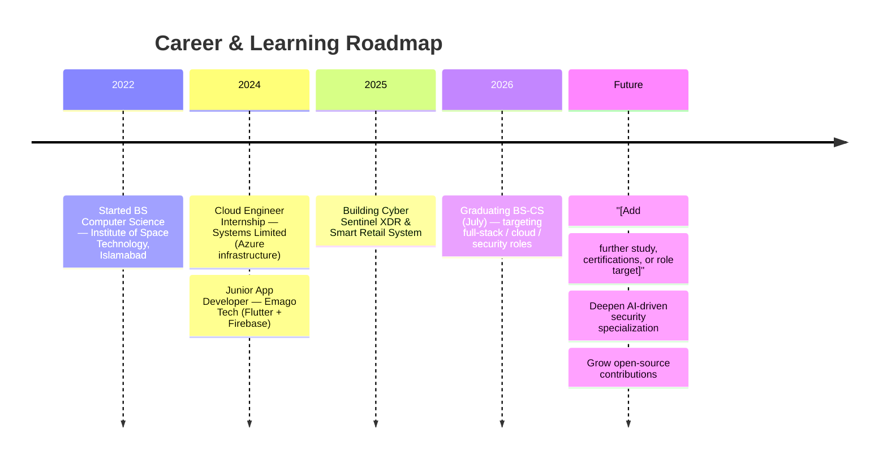

<div align="center">



<br/>

<a href="https://github.com/lucifer-1589">
  
</a>

<a href="https://github.com/lucifer-1589">
  
</a>

<br/>

[](https://portfolio-zeta-gules-auwmssljmj.vercel.app)
[](https://www.linkedin.com/in/annas-habib-b5b13b28a/)
[](mailto:annashabib02283@gmail.com)
[](#)


[](https://github.com/lucifer-1589?tab=followers)

</div>


## About Me

I'm a Computer Science undergraduate at the **Institute of Space Technology, Islamabad** (graduating July 2026), building toward a career at the intersection of **full-stack engineering, cloud infrastructure, and AI-driven security systems**.

I've spent my internships doing exactly that in production: architecting Azure infrastructure at **Systems Limited** and shipping cross-platform mobile apps at **Emago Tech**. Outside of internships, I build my own systems end-to-end — most recently an AI-assisted threat detection platform and a full retail management system — because I'd rather learn by shipping than by reading about it.

What I care about, in order:

- **Building things that hold up in production** — not demos, working software
- **Security as a design constraint**, not an afterthought bolted on later
- **Cloud-native architecture** that's cheap to run and easy to reason about
- **Applying AI/ML pragmatically** — where it solves a real problem, not because it's trendy
- **Continuous learning** — currently deepening my cybersecurity and cloud coursework alongside project work


## Tech Stack

<div align="center">

**Languages**


**Frontend & Mobile**


**Backend**


**Databases**


**Cloud & Platform**


**Tools**


<!--
  ADD-MORE-HERE: this section is grouped by category on purpose — drop new
  shields.io badges (https://shields.io) into the matching category as your
  stack grows (e.g. Docker/Kubernetes once you're using them in a real project).
-->

</div>


## Skills Dashboard

<sub>Self-assessed proficiency — updated as skills grow, not a benchmarked score.</sub>

| Domain | Level | |
|---|---|---|
| Full-Stack Development | ████████████████░░░░ 80% | 🟢 Strong |
| Cloud Engineering (Azure) | ██████████████░░░░░░ 70% | 🟢 Solid |
| Mobile Development (Flutter) | ██████████████░░░░░░ 70% | 🟢 Solid |
| Database Design | ██████████████░░░░░░ 70% | 🟢 Solid |
| Cybersecurity Fundamentals | ████████████░░░░░░░░ 60% | 🟡 Growing |
| Machine Learning / AI | ██████████░░░░░░░░░░ 50% | 🟡 Growing |
| System Design | ██████████░░░░░░░░░░ 50% | 🟡 Growing |
| Networking | ██████████░░░░░░░░░░ 50% | 🟡 Growing |
| API Development | ██████████████░░░░░░ 70% | 🟢 Solid |
| UI/UX | ████████████░░░░░░░░ 60% | 🟡 Growing |


## Featured Projects

### 🛡️ Cyber Sentinel XDR
**AI-Powered Multi-Domain Threat Detection & Automated Response Platform**

| | |
|---|---|
| **Description** | An extended detection & response (XDR) platform that correlates signals across endpoints, network, and cloud to flag threats and trigger automated response actions. |
| **Tech Stack** | `[Add: e.g. Python, FastAPI, React, MongoDB]` |
| **Repository** | `[Add repo link]` |
| **Live Demo** | `[Add demo link, if deployed]` |
| **Documentation** | `[Add docs link]` |
| **Status** | 🚧 In Development |
| **Stars** | `[Add once public: ]` |

**Key Features**
- `[Add feature — e.g. real-time multi-source log ingestion]`
- `[Add feature — e.g. ML-based anomaly scoring]`
- `[Add feature — e.g. automated containment playbooks]`

**Conceptual Architecture** <sub>(update once the real implementation is locked in)</sub>

```mermaid
flowchart LR
    A[Endpoints / Network / Cloud Logs] --> B[Ingestion Layer]
    B --> C[Detection Engine\n(rules + ML scoring)]
    C --> D{Threat Verdict}
    D -->|Benign| E[Log Store]
    D -->|Suspicious| F[Alerting]
    D -->|Malicious| G[Automated Response\n(isolate / block / notify)]
    F --> H[Analyst Dashboard]
    G --> H
```

**Roadmap**
- `[Add next milestone]`
- `[Add next milestone]`

---

### 🛒 Smart Retail System
**Intelligent Point-of-Sale & Inventory Management Solution**

| | |
|---|---|
| **Description** | A POS and inventory management system for retail operations — sales processing, stock tracking, and reporting in one place. |
| **Tech Stack** | `[Add: e.g. React, Node.js, MySQL]` |
| **Repository** | `[Add repo link]` |
| **Live Demo** | `[Add demo link, if deployed]` |
| **Documentation** | `[Add docs link]` |
| **Status** | 🚧 In Development |
| **Stars** | `[Add once public: ]` |

**Key Features**
- `[Add feature — e.g. real-time inventory sync]`
- `[Add feature — e.g. sales analytics dashboard]`
- `[Add feature — e.g. multi-till / multi-branch support]`

**Roadmap**
- `[Add next milestone]`

---

<div align="center"><sub>

More projects live on my [pinned repositories](https://github.com/lucifer-1589?tab=repositories) — this section is intentionally kept to featured work only.

</sub></div>


## GitHub Analytics

<div align="center">


</div>

<sub>All widgets above pull live data from `lucifer-1589` via public read-only APIs — no hardcoded numbers. See <a href="./MAINTENANCE.md">MAINTENANCE.md</a> for how to re-theme or replace them.</sub>


## Cybersecurity — Focus Areas

Building toward this through coursework and applied project work (Cyber Sentinel XDR), not yet a professional specialization — tracked here honestly as an active learning path.

<table>
<tr>
<td width="50%">

**Threat Detection**
Correlating signals across endpoints/network/cloud to identify malicious activity.

**Incident Response**
Structured playbooks for containment and recovery once a threat is confirmed.

**Cloud Security**
Hardening Azure workloads — access control, network segmentation, secrets management.

</td>
<td width="50%">

**AI Security**
Using ML models to score anomalies and reduce alert fatigue.

**Network Monitoring**
Traffic analysis and baselining to catch deviations early.

**Digital Forensics & Malware Analysis**
`[Currently coursework-level — expand as hands-on experience grows]`

</td>
</tr>
</table>


## AI — Currently Exploring

Applying AI where it solves a real problem inside my own projects, rather than claiming specialization I haven't earned yet.

`Machine Learning` · `Deep Learning Fundamentals` · `NLP` · `Computer Vision` · `LLM-based Automation` · `RAG` · `AI Agents`

<sub>`[Update this line as specific frameworks/tools are added to real projects — e.g. scikit-learn, PyTorch, LangChain]`</sub>


## Timeline




## Certifications

<sub>Shown honestly by status — nothing here is claimed as earned until it actually is.</sub>

| Certification | Provider | Status |
|---|---|---|
| AZ-900: Azure Fundamentals | Microsoft | `Planned` |
| AWS Certified Cloud Practitioner | AWS | `Planned` |
| Google Cybersecurity Certificate | Google | `Planned` |
| `[Add more as you start them]` | — | — |


## Open Source

| | |
|---|---|
| **Contributions** | `[Add: link notable PRs/issues once made]` |
| **Maintained Projects** | `[Add: repos you actively maintain]` |
| **Community** | `[Add: Discord/forum communities you're active in]` |
| **Documentation** | `[Add: docs you've written for OSS projects]` |
| **Mentorship** | Mentored 3+ junior interns on Azure architecture & deployment at Systems Limited |


## Writing

<!--
  Auto-populate this section with your latest posts using the
  gautamkrishnar/blog-post-workflow GitHub Action — see MAINTENANCE.md
  for the exact setup. Until connected, this stays a clean placeholder.
-->
<!-- BLOG-POST-LIST:START -->
- `[Connect a blog/RSS feed to auto-populate this list — see MAINTENANCE.md]`
<!-- BLOG-POST-LIST:END -->


## A Few Honest Facts

- 🎓 Graduating with a BS in Computer Science in July 2026, CGPA 3.5/4.0
- 📍 Based in Rawalpindi, Pakistan
- 🗣️ Fluent in English and Urdu
- 🏗️ Currently building an AI-assisted XDR threat detection platform
- ☁️ Went from zero to architecting enterprise Azure infrastructure in one internship


## Let's Connect

<div align="center">

I'm most active on GitHub — for anything else, reach out directly.

[](https://portfolio-zeta-gules-auwmssljmj.vercel.app)
[](https://www.linkedin.com/in/annas-habib-b5b13b28a/)
[](mailto:annashabib02283@gmail.com)


</div>
